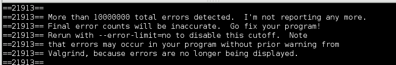

# DevMtn Debugging Guide

When you see a cascade of red error messages in your console, it can be overwhelming to know how to start the process of debugging them. In many cases, you'll find errors hiding behind other errors in the logical flow of your program. 

This is an error message I got when I was first learning to program.

It's pretty brutal.

To help you guys develop a debugging mind-set, I have written down the questions you should ask yourself when you run into a tricky bug. You should consult this guide before joining the Q. 

When you join the Q, the other mentors and I will be expecting answers to these questions (or at least some attempted searches using Google, StackExchange, or the docs themselves).

## General

### Erorr message

* What does it say?
* Do you understand it?
  - If not, have you checked Stack Exchange?
* Where is it pointing you?

### Undefined variable

* Set some breakpoints!
* When does it become undefined?
* Where are you setting the variable throughout your code?

### Set-up

* Cannot find module
  - Did you npm install your packages?
* No variables on process.env
  - Is the .env file in your root directory?
* Node/Nodemon not starting up?
  - Are you running the command in the right folder?
  - Check your main key in package.json

## Network

### 404

* Check your URL's 

### 500

* Is your server running?

### 401 (3rd party API)

* Is your API key correct?
  - Test it with Postman

## React

### Props

* What is the structure of your app's components?
* Did you name it differently when you passed it as a prop?
* Did you bind your methods in the correct component?

### Module not found

* Check your path names when you import or require
* Are you also exporting the code you want to be available?

### Cannot forward axios requests

* Check your proxy in package.json

# Future debugging sections!

Slack me if you want more debugging sections, and they'll be added!

## Axios

## Express

## Massive/SQL
